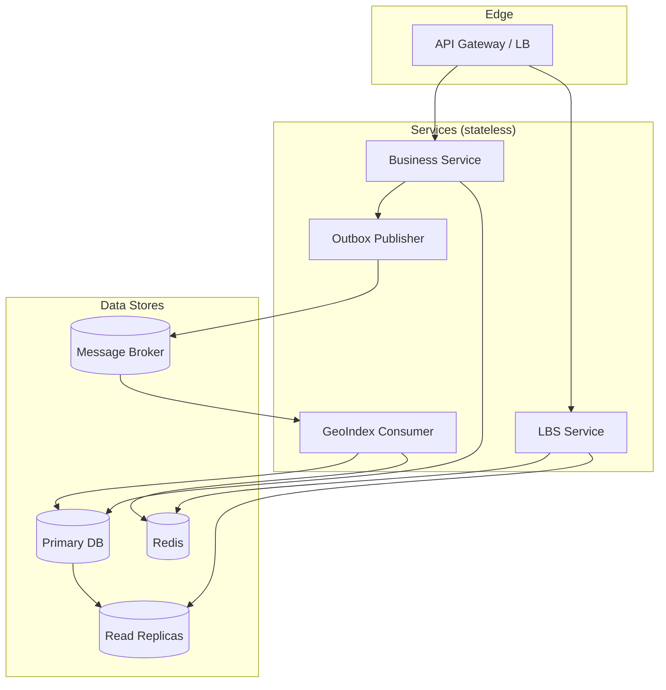
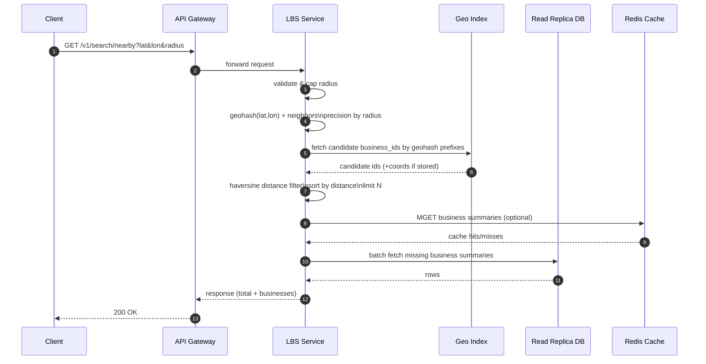
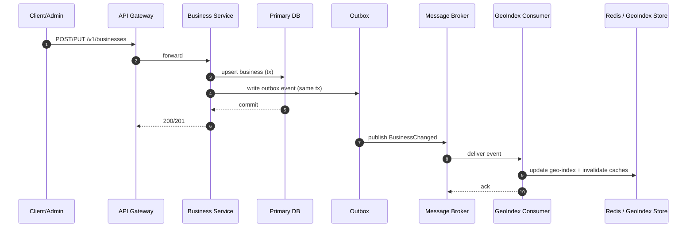

# Proximity Service (Nearby Search)

## Overview

Proximity Service — это backend-сервис для поиска ближайших объектов (businesses) по географическим координатам.
Типичный use case — поиск ресторанов, магазинов или сервисов поблизости, аналогично Yelp или Google Maps Nearby.

Система предоставляет:
- поиск ближайших business по координатам и радиусу;
- CRUD-операции для business;
- масштабируемую архитектуру, оптимизированную под read-heavy нагрузку.

Проект предназначен для генерации Java-приложения (Spring Boot) на основе данного README.

---

## Functional Requirements

### Nearby Search
- Входные параметры:
  - latitude (double)
  - longitude (double)
  - radius (int, метры, optional, default = 5000, max = 20000)
- Выход:
  - список business в пределах радиуса
  - расстояние до каждого business
  - общее количество найденных объектов

### Business Management
- Создание business
- Обновление business
- Удаление business
- Получение деталей business по ID

---

## Non-Functional Requirements

- **Latency**: p95 < 200 ms для nearby search
- **Availability**: 99.9%
- **Scalability**: горизонтальное масштабирование stateless-сервисов
- **Consistency**: eventual consistency между business data и geo-index
- **Privacy**: координаты пользователей не сохраняются

---

## High-Level Architecture

### Components

1. **API Gateway / Load Balancer**
   - маршрутизация HTTP-запросов
   - rate limiting и базовая валидация

2. **LBS (Location-Based Service)**
   - обработка nearby search
   - read-heavy, stateless
   - горизонтально масштабируется

3. **Business Service**
   - CRUD-операции для business
   - управление бизнес-данными

4. **Storage**
   - Primary DB — запись данных
   - Read Replicas — чтение
   - Geo Index Storage — пространственный индекс

5. **Cache (Redis)**
   - кэш business details
   - опциональный кэш geo-index

### Request Flow (Nearby Search)

1. Клиент отправляет запрос с координатами
2. API Gateway маршрутизирует запрос в LBS
3. LBS вычисляет geohash и соседние клетки
4. Из geo-index извлекаются кандидаты
5. Выполняется точная фильтрация по расстоянию
6. Подгружаются данные business
7. Формируется ответ


## Diagrams

### C4 Level 1 — System Context

```mermaid
flowchart LR
  U[User / Mobile App] -->|HTTPS| G[API Gateway / Load Balancer]
  G -->|/v1/search/nearby| LBS[LBS: Nearby Search Service]
  G -->|/v1/businesses/*| BS[Business Service]

  LBS -->|read| GI[Geo Index Storage]
  LBS -->|read (batch)| BR[(Business Read Replica)]
  BS -->|write| P[(Primary DB)]
  P -->|replication| BR

  LBS <-->|cache| R[(Redis Cache)]
  BS <-->|cache| R
```

### C4 Level 2 — Container View (Target)



### Sequence — Nearby Search



### Sequence — Business Upsert (Target with Outbox)




---

## API Specification

### Nearby Search

```
GET /v1/search/nearby?latitude=37.7749&longitude=-122.4194&radius=5000
```

Response:
```
{
  "total": 2,
  "businesses": [
    {
      "id": "uuid",
      "name": "Coffee Shop",
      "latitude": 37.775,
      "longitude": -122.418,
      "distanceMeters": 120
    }
  ]
}
```

### Business APIs

- `GET /v1/businesses/{id}`
- `POST /v1/businesses`
- `PUT /v1/businesses/{id}`
- `DELETE /v1/businesses/{id}`

---

## Data Model

### business

| Field        | Type    | Description |
|-------------|---------|-------------|
| business_id | UUID PK | Business ID |
| name        | String  | Name |
| latitude    | double  | Latitude |
| longitude   | double  | Longitude |
| address     | String  | Address |
| updated_at  | time    | Last update |

### geo_index

| Field        | Type    | Description |
|-------------|---------|-------------|
| business_id | UUID PK | Business ID |
| geohash     | String  | Geohash prefix |
| latitude    | double  | Latitude |
| longitude   | double  | Longitude |

Index:
- B-tree index on `geohash`

---

## Geo Indexing Strategy

### Geohash

- Используется Geohash для разбиения пространства
- Длина geohash выбирается на основе радиуса поиска

| Radius (km) | Geohash Length |
|------------|----------------|
| <= 1       | 6 |
| <= 5       | 5 |
| <= 20      | 4 |

### Boundary Handling

- Для каждой geohash-клетки вычисляются 8 соседних
- Поиск выполняется по основной и соседним клеткам
- Итоговая фильтрация выполняется через Haversine distance

---

## Consistency Model

- Business data — source of truth
- Geo-index обновляется:
  - MVP: синхронно при записи
  - Target: через outbox + event consumer
- Допускается eventual consistency

---

## Scalability Considerations

- Stateless сервисы
- Горизонтальное масштабирование
- Read replicas
- Batch loading business data
- Redis cache для business details

---

## Project Structure (Recommended)

```
.
├── src/main/java
│   ├── adapter        # REST controllers, DTO
│   ├── application    # use cases
│   ├── domain         # entities, value objects
│   └── infrastructure # JPA, Redis, messaging
├── docker-compose.yml
└── README.md
```

---

## Milestones

### M1
- CRUD business
- DB schema and migrations

### M2
- Geo-index
- Nearby search endpoint

### M3
- Performance optimizations
- Caching

### M4
- Outbox pattern
- Service separation

---

## Local Development

- Java 17
- Spring Boot 3
- PostgreSQL
- Redis
- Docker Compose

---

## Notes

Данный README является единственным источником требований и архитектуры.
Проект должен быть сгенерирован строго в соответствии с данным описанием.

---

## Architecture Decision Records (ADRs)

- [ADR-0001: Geo Indexing Strategy — Geohash + Neighbors](docs/adr/0001-geo-indexing-strategy.md)
- [ADR-0002: Consistency Between Business Data and Geo Index — Outbox Pattern](docs/adr/0002-outbox-consistency.md)
- [ADR-0003: Service Decomposition — Modular Monolith First, Split Later](docs/adr/0003-service-decomposition.md)
- [ADR-0004: Caching Strategy — Business Details and Search-Aware Keys](docs/adr/0004-caching-strategy.md)
- [ADR-0005: Storage Choices — PostgreSQL + Optional Redis, PostGIS as Future Option](docs/adr/0005-storage-choices.md)

---

## Acceptance Criteria

### API correctness
- `GET /v1/search/nearby` validates inputs:
  - latitude ∈ [-90, 90], longitude ∈ [-180, 180]
  - radius default = 5000, max = 20000; values outside range return 400
- Nearby search returns only businesses with `distanceMeters <= radius`
- Results are sorted by `distanceMeters` ascending (tie-breaker: `id` ascending)
- CRUD endpoints return proper HTTP status codes:
  - POST: 201 + created entity id
  - GET existing: 200; missing: 404
  - PUT existing: 200; missing: 404 (or 404/409—choose one and document)
  - DELETE existing: 204; missing: 404

### Geo-index correctness (MVP)
- On create/update with changed coordinates, `geo_index.geohash` is recomputed and persisted
- Nearby search expands to the current cell + 8 neighbors for the chosen precision
- Final filtering uses Haversine distance (not Manhattan / not planar approximation)

### Persistence and migrations
- Flyway/Liquibase creates `business` and `geo_index` tables on startup
- `geo_index` has an index on `geohash` for prefix queries
- Local `docker-compose` starts required dependencies

### Testing
- Unit tests:
  - geohash precision mapping
  - neighbor expansion (returns 9 cells total)
  - haversine correctness on known coordinate pairs
- Integration tests (Testcontainers recommended):
  - CRUD happy paths
  - nearby search returns deterministic results for seeded dataset

### Observability (minimum)
- Structured logs for API requests (method/path/status/latency)
- Basic metrics endpoint (Spring Actuator) enabled

---

## Codex / Generator Checklist (Implementation Constraints)

To ensure deterministic generation, implement the following explicitly:
- Java 17, Spring Boot 3, Maven
- Layering: `adapter`, `application`, `domain`, `infrastructure`
- Controllers only in `adapter`
- Business logic (use cases) only in `application`
- Distance computation as a `domain` service (`DistanceCalculator`)
- Persistence via Spring Data JPA in `infrastructure`
- DTOs distinct from entities; mapping via MapStruct (preferred) or manual mappers
- Validation via Jakarta Bean Validation
- OpenAPI via springdoc-openapi, producing `/v3/api-docs` and Swagger UI
- Provide `docker-compose.yml` for Postgres + Redis (Redis optional but included)
- Provide minimal seed data script or test fixture for local verification
